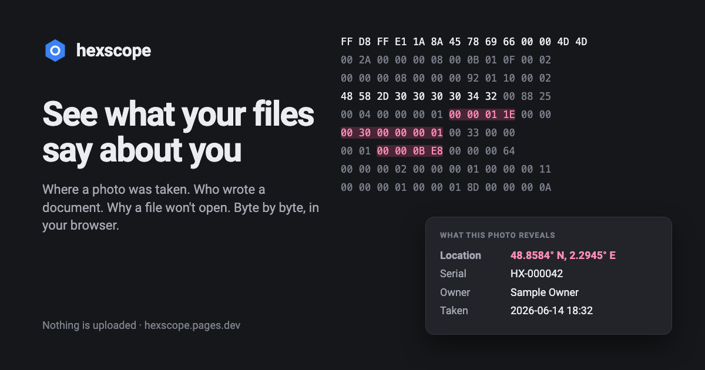

# Hexscope

**See what a file reveals before you share it.** Inspect metadata, hidden content,
unexpected structure and damage — then make a clean copy when Hexscope can do so
safely. Your files stay on your device.

[Open Hexscope](https://hexscope.pages.dev/?sample=photo.jpg) ·
[Install the CLI](https://crates.io/crates/hexscope-cli) ·
[Privacy](https://hexscope.pages.dev/your-files-stay-private) ·
[Guides](https://hexscope.pages.dev/remove-location-from-photo)



## Try it

Open the [web app](https://hexscope.pages.dev/) and choose a file, or
[load the sample photo](https://hexscope.pages.dev/?sample=photo.jpg). Hexscope
shows a plain-language summary first. Select a finding to see the exact bytes
behind it; where supported, save a clean copy from the same page.

It also works offline after the first visit. File parsing happens in your
browser: Hexscope does not upload your files or send telemetry.

## What you can do

- **Check before sharing.** Find photo location and camera details, PDF content
  hidden under black boxes, document history and comments, email indicators,
  embedded files, and more.
- **Inspect the evidence.** Explore a file's structure and bytes, search within
  it, compare files, and follow image pixels to the bytes that produced them.
- **Make a copy.** Remove supported metadata, redact PDF text or selected areas,
  and recover supported damaged PNG, JPEG and ZIP files. Hexscope explains what
  it changed so you can inspect the result.
- **Learn how formats work.** Step through DEFLATE decoding and explore how PNG
  and JPEG data maps to the image.

### Formats

Hexscope reads PNG, JPEG, HEIC/HEIF, AVIF, WebP, GIF, MP4/QuickTime, PDF, ZIP
archives and common files inside them (`.docx`, `.xlsx`, `.pptx`, `.apk`, `.jar`,
`.epub`), legacy Office files (`.doc`, `.xls`, `.ppt`), `.eml`, Outlook `.msg`,
and WebAssembly modules. What it can inspect or change varies by format. For
known limits — including password-protected PDFs and legacy Office document
text — see [known issues](docs/known-issues.md).

Hexscope is a file-structure inspector, **not a virus scanner**. It does not
open links or follow redirects. A finding is an explanation of what the parser
can establish from the file, not a guarantee that a file is safe.

## Use the CLI

Install the published `hexscope` command:

```sh
cargo install --locked hexscope-cli
```

```sh
hexscope check photos/                              # inspect files in a folder
hexscope check --fail-on location,serial photos/    # choose what fails the check
hexscope clean --out clean/ photos/                 # write clean copies separately
hexscope repair --out recovered/ broken.png         # recover supported damaged files
hexscope redact --text "Private Name" report.pdf    # redact matching PDF text
```

`check` reads files and folders recursively. By default, it exits with `1` when
it finds disclosures, hidden content or damage; `--fail-on` can select finding
types, and `--fail-on none` reports without failing. Exit `2` means a usage or
file error. Symlinks and unreadable folders stop the scan with an error rather
than being silently skipped. Use `--json` for newline-delimited JSON or `--sarif`
for SARIF 2.1.0.
Run `hexscope --help` for all options. Clean and repaired files are written as
copies by default; `clean --in-place` is available when you explicitly want to
replace the originals.

### GitHub Actions

The published Action checks paths and annotates selected findings on their files:

```yaml
- uses: actions/checkout@v7
- uses: MykytaStel/hexscope@v0.1.0
  with:
    paths: photos docs
    fail-on: location,serial,covered,hiddentext
```

Annotations name the file and finding kind, but leave actual values out of CI
logs. When `check` runs in GitHub Actions, its default human output is suppressed
for the same reason; explicitly requested `--json` and `--sarif` remain detailed.

For other CI systems, save a SARIF report with
`hexscope check --sarif --fail-on none PATH...` and upload it to your code
scanning service.

## Guides

- [Film photo lab: negative conversion, border crop and output inspection](docs/film-lab.md)
- [Verified photo batches, CLI/web film rolls, TIFF16 and local privacy mosaic](docs/photo-platform.md)
- [Reproducible real-scan measurements and research limits](docs/film-evaluation.md)

- [Remove location and other metadata from a photo](https://hexscope.pages.dev/remove-location-from-photo)
- [What an edited PDF may still contain](https://hexscope.pages.dev/pdf-hidden-versions)
- [Why a PNG may not open](https://hexscope.pages.dev/png-wont-open)
- [Explore DEFLATE step by step](https://hexscope.pages.dev/deflate)

## For Rust users and contributors

Version `0.1.0` is published on crates.io:

- [`hexscope-cli`](https://crates.io/crates/hexscope-cli) — command-line tool.
- [`hexscope-core`](https://crates.io/crates/hexscope-core) — parsing library.
- [`hexscope-inflate`](https://crates.io/crates/hexscope-inflate) — explainable
  DEFLATE and zlib decoding.

To run the web app locally, install the pinned Rust toolchain, Node.js 24+,
pnpm and the matching `wasm-bindgen` CLI, then run:

```sh
rustup toolchain install
cargo install wasm-bindgen-cli --version 0.2.128 --locked
pnpm install
pnpm dev
```

See [CONTRIBUTING.md](CONTRIBUTING.md) for project structure, checks and
contribution guidance. Known product and format limits are tracked in
[`docs/known-issues.md`](docs/known-issues.md). See the
[project roadmap](docs/roadmap.md) for planned work and research candidates.

## License

Licensed under either [MIT](LICENSE) or [Apache License 2.0](LICENSE), at your
option.
